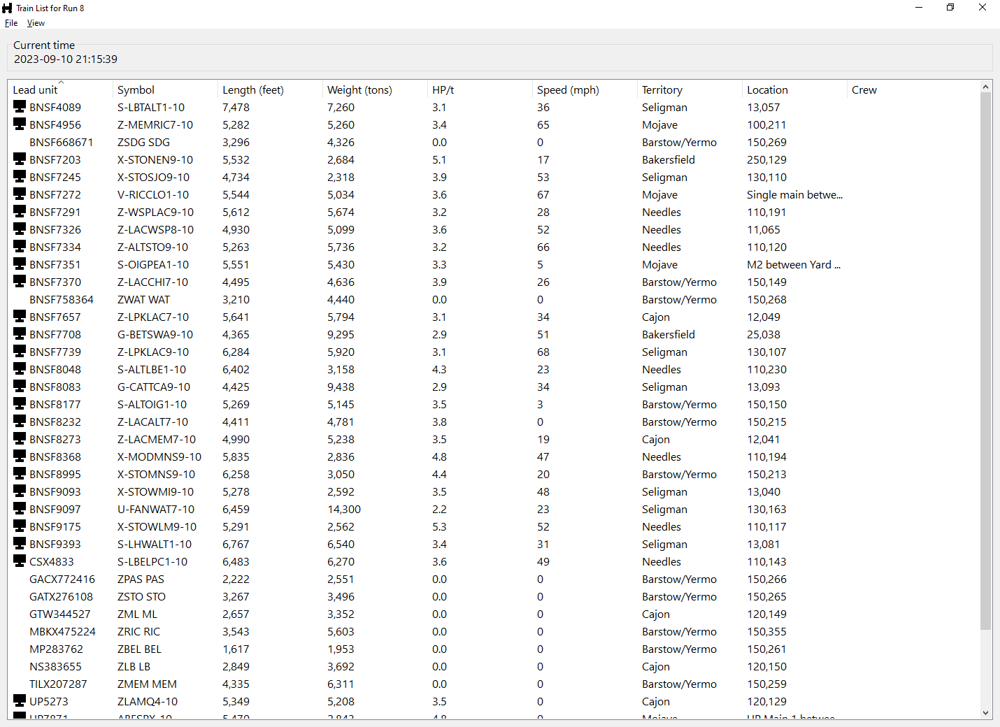

Train List for Run 8
====================

This tool connects to Run 8 the same way as an external dispatcher application and displays information about all dispatcher-visible trains in the world. It’s not a full dispatch application, there are no controls, it is purely for displaying information.

Installation
------------

The program can be downloaded from [GitLab releases](https://gitlab.com/Hawk777/trainlist8/-/releases) or [GitHub releases](https://github.com/Hawk777/trainlist8/releases) (grab the `.exe` file). The `.exe` file can be saved anywhere and run; no installation is needed. It can be run on the same computer as Run 8 or a different computer. You must enable the “external dispatcher” switch in Run 8 before connecting.
